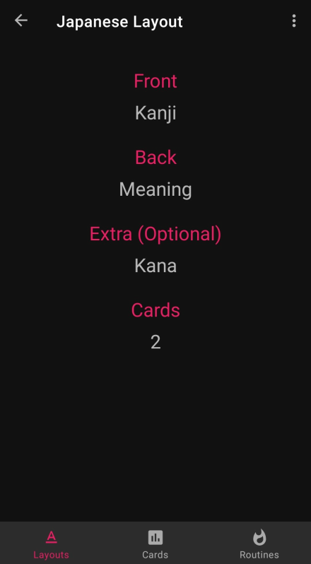
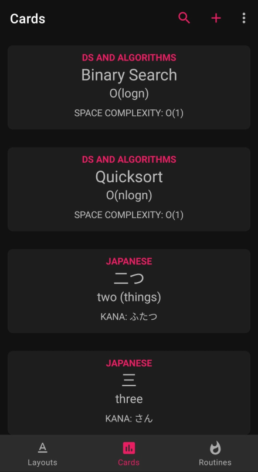
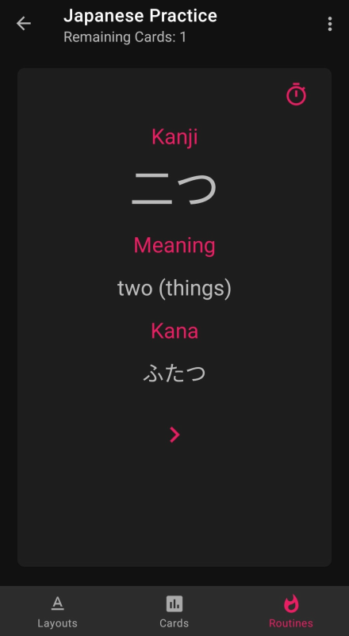

# Refresh

  
  <h3 align="center">Refresh</h3>
  

    Simple and easy-to-use flashcard application  
      
    
    
    
  

  <h3>Features</h3>
  <ul>
  <li>Create custom layouts with upto three fields</li>
  <li>Add flashcards based on different layouts</li>
  <li>Create routines using multiple layouts</li>
  <li>Reset progress or flashcard delay</li>
  </ul>
  <h3>Installation</h3>
  <ol>
  <li>Clone the repository</li>
  <li>Open the project in Android Studio</li>
  <li>Build and run the application</li>
  </ol>

